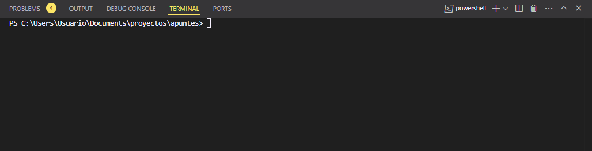
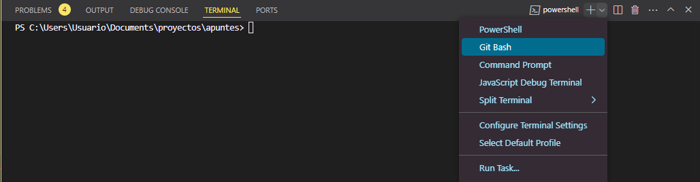

# Notas y apuntes de repositorios github

> ## **Subir un nuevo repositorio desde cero**

### 1. Crea tu proyecto y create una cuenta de github

>*es importante que nos apuntemos las credenciales ya que las necesitaremos más tarde.*

Una vez tengamos nuestro proyecto abriremos con **CMD** o **GitBush** la ruta de nuestro archivo.

De esta forma podremos abrir **Visual studio** directamente con el comando:

```shell
code .
```

Una vez abierto VS pasaremos al siguiente punto de la lista.

### 2. Creacion de un archivo README y comit

Dentro de **Visual Studio** abriremos nuestro terminal, lo configuraremos de la siguiente forma para que trabaje con **Git** en vez de con **PowerShell**:





>*Haremos esto para evitar errores relacionados con Git.*
tras esto volveremos a **VS** y crearemos un archivo dentro de nuestra carpeta
que debe llamarse exactamente así:

```shell
README.md
```

Nos dirigiremos a nuestro navegador nuevamente y en
**GitHub** y haremos click en "*subir repositorio*", copiamos la URL que se nos proporciona y 
en nuestro ya configurado terminal copiamos:

```shell
git remote add origin REMOTE_URL
```

>en el  **REMOTE_URL**  debe ir la URL que previamente recogiste de 
**GitHub**

### 3. Verificar la URL y commit

Para verificar simplemente utilizaremos el siguiente comando en nuestra terminal:

```shell

git remote -v

```

Mientras para hacer un commit manual escribiremos lo siguiente:

```shell

git push origin master

```

>*Master puede cambiar a main o viceversa

Así ya tendremos los cambios realizados en nuestros repositorio
y todo estará listo para hacer commit de nuestros proyectos.
